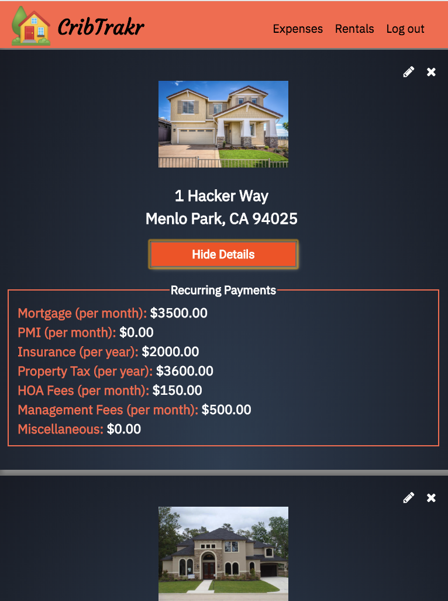

### Status
[](https://travis-ci.org/maddiereddy/cribtrakr-client)   
# <i>CribTrakr
### Keeps track of user's rental properties and associated expenses by allowing user to:
* add property info like address, picture and related expenses.
* edit or delete info pertaining to any property or expense.
* filter expenses based on property or a date range.
<br>

# Links
## Live App: <br>
https://cribtrakr.netlify.com/  <br>   
<u><b>Demo Account Credentials:</b></u>    
**Username:** demo  
**Password:** password 
<br>    
Server Github Repo: https://github.com/maddiereddy/cribtrakr-api   
Client Github Repo: https://github.com/maddiereddy/cribtrakr-client   
## To Run Locally   
 Git Clone this repo  
 cd into folder  
`npm install`  
`npm start`    
Add .env file with API URL and variable name `REACT_APP_API_BASE_URL`   
## API   
I built my own RESTful API which will allow users to add, delete, get and update all rental properties and related expenses. Hosted at https://evening-oasis-38989.herokuapp.com/ <br>
<br> 

## API endpoints    
### GET   
All Rental Properties  ````.../api/rentals/````    
A particular property  ````.../api/rentals/:id````    
All expenses           ````.../api//expenses````    
All expenses for a property ````.../api/expenses/prop/:propId````    
A particular expense   ````.../api//expenses/:id````    
### PUT    
Update property       ````.../api/rentals/:id````    
Update an expense     ````.../api/expenses/:id````    
### DELETE    
Delete property       ````.../api/rentals/:id````    
Delete expense        ````.../api/expenses/:id````    
### POST    
Add a new property    ````.../api/rentals/````   
Add a new expenses    ````.../api/expenses/````   
<br>
## Technology Stack
### Front End
* React
* Redux
* HTML
* CSS
* Enzyme
* Jest
### Server Side
* Node
* Express
* Mongoose
* MongoDB
* Mocha
* Chai
## Screenshots

### Landing page:<br>
 <br>
<br>
### My Rental Properties page:<br>
 <br>
<br>
### Details page:<br>
 <br>
<br>
### Expenses page:<br>
 <br>
<br>
## Nice-to-have-features for future version
* Ability to add images of expense receipts
* Be able to search/filter expenses by a phrase or name
* Create reports (for export and printing). This would be useful for tax preparation
